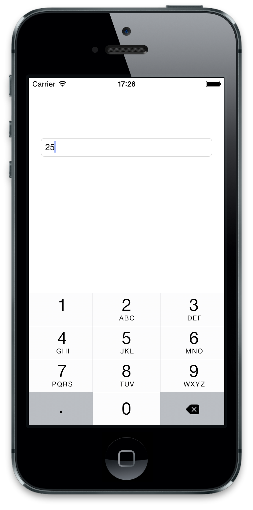
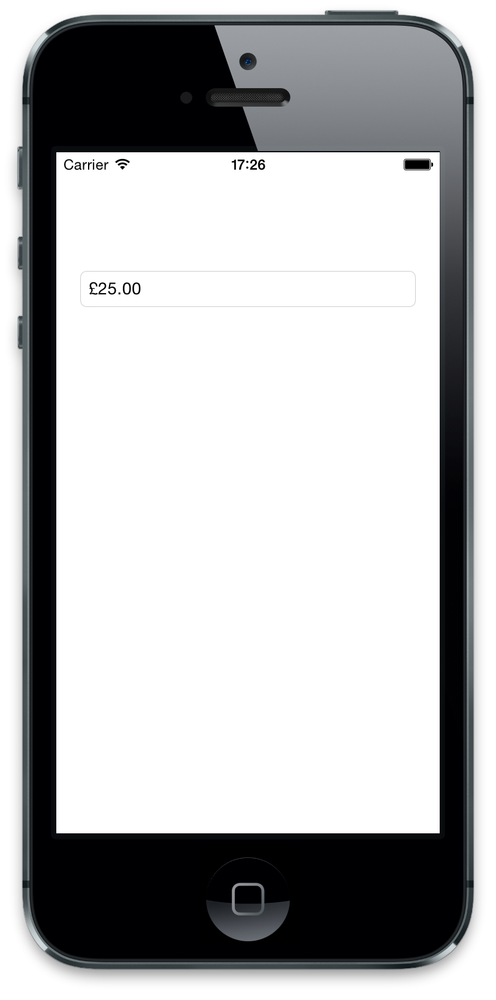

# JDFCurrencyTextField

[](http://cocoadocs.org/docsets/JDFCurrencyTextField)
[](http://cocoadocs.org/docsets/JDFCurrencyTextField)
[](http://cocoadocs.org/docsets/JDFCurrencyTextField)

JDFCurrencyTextField is a drop-in replacement for UITextField to make it easier to work with monetary values. JDFCurrencyTextField makes it easier to enter monetary values because it formats the cell's text as a numeric string while the user is editing it, and formats it back to a currency string when they have finished. It defaults to using the currentLocale for the formatting, but this can be changed if necessary.

## Usage

JDFCurrencyTextField is a drop in replacement for UITextField.

To set the currency value of the text field, you can either set the field's `decimalValue`, or you can alternatively you can set the `text` property with a numeric string (not formatted as currency).

``` objc
JDFCurrencyTextField *currencyField = [[JDFCurrencyTextField alloc] initWithFrame:frame];
currencyField.decimalValue = [[NSDecimalNumber alloc] initWithDouble:9.99];
```
or
``` objc
JDFCurrencyTextField *currencyField = [[JDFCurrencyTextField alloc] initWithFrame:frame];
currencyField.text = @"100";
```

You can then retrieve the value again as an `NSDecimalNumber` via the `decimalValue` property.

You can change the locale that is used for the currency formatting. To do this, set your JDFCurrencyTextField's `locale` property with your desired locale. You should do this before setting the `text` property.

To run the example project, clone the repo, and run `pod install` from the Example directory first.

## Screenshots

The user enters a value:



When they finish editing, the value is formatted as a currency:



## Installation

JDFCurrencyTextField is available through [CocoaPods](http://cocoapods.org). To install
it, simply add the following line to your Podfile:

    pod "JDFCurrencyTextField"

## Apps

JDFCurrencyTextField is being used in [Live Poker Manager](https://itunes.apple.com/gb/app/live-poker-manager-app/id828305743?mt=8). It'd be cool to know if you're using it in any of your apps as well :)

## Author

Joe Fryer, joe.d.fryer@gmail.com

## License

JDFCurrencyTextField is available under the MIT license. See the LICENSE file for more info.
